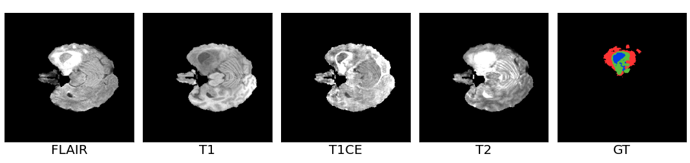
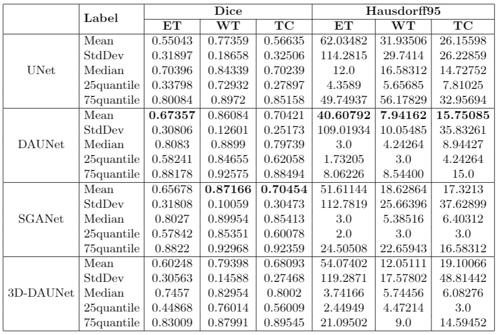
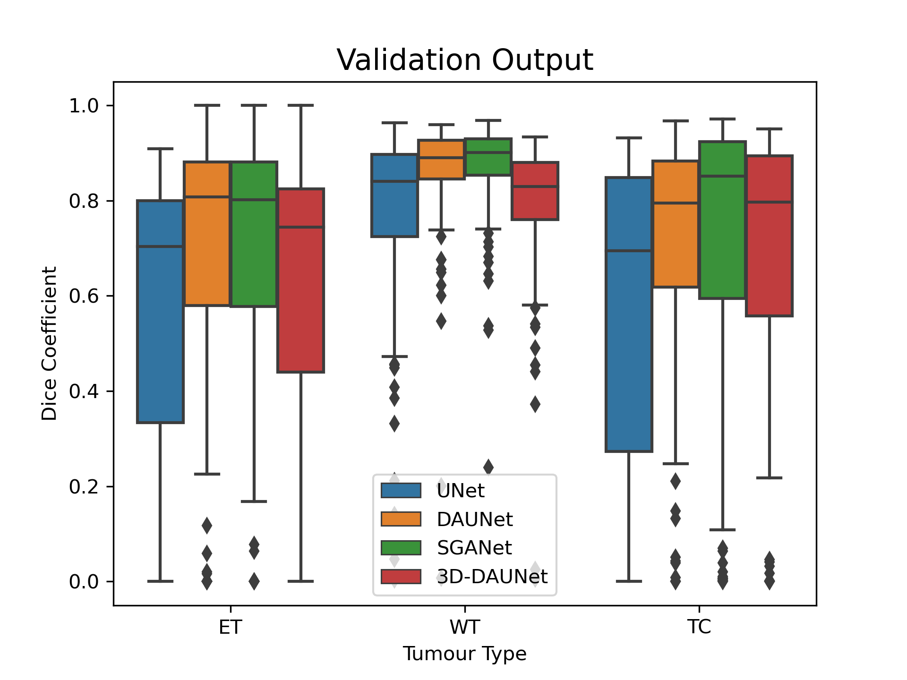

# Deep Supervised Attention Networks for Pixel-wise Brain Tumour Segmentation 
Deep learning project for Brain Tumour Segmentation for OVGU Magdeburg Winter Semester 2020 supervised by Jia Hua Xu and Prof.Andreas Nürnberger, Data and Knowledge Engineering Group
Faculty of Computer Science, Otto von Guericke University Magdeburg, Germany. The deep learning framework for this project is TensorFlow 2.0. 

## Motivation
Glioblastoma (GBM) is one of the leading causes of cancer death. The imaging diagnostics are critical for all phases in the treatment of brain tumour. However, manually-checked output by a radiologist has several limitations such as tedious annotation, time consuming and subjective biases, which influence the outcome of a brain tumour affected region. Therefore, the development of an automatic segmentation framework has attracted lots of attention from both clinical and academic researchers. To validate our work, we set UNet as our baseline model and proposed two novel 2D network architectures as well as one 3D network architecture. Our first proposed model Deep supervised Attention Unet(DAUNet), extends the infamous UNet framework with the addition of attention gates in the skip connection path and deep supervision in the upsampling path. Our second proposed model, multi-scale Self Guided Attention Network(SGANet), attempts to compensate the lack of multi-scale features in the UNet framework by incorporate guided self-attention mechanism and deep supervision for multi-scale features. Our third proposed model, (3D-DAUNet), further the work of our first proposed model(DAUNet), by extending a dimension with 3D convolutional layers.

## Paper
[A Deep Supervised U-Attention Net for Pixel-Wise Brain Tumor Segmentation](https://link.springer.com/chapter/10.1007%2F978-3-030-72087-2_24) by Jia Hua Xu, Wai Po Kevin Teng and Andreas Nürnberger. 
```
@incollection{Xu2021,
  doi = {10.1007/978-3-030-72087-2_24},
  url = {https://doi.org/10.1007/978-3-030-72087-2_24},
  year = {2021},
  publisher = {Springer International Publishing},
  pages = {278--289},
  author = {Jia Hua Xu and Wai Po Kevin Teng and Xiong Jun Wang and Andreas N\"{u}rnberger},
  title = {A Deep Supervised U-Attention Net for Pixel-Wise Brain Tumor Segmentation},
  booktitle = {Brainlesion: Glioma,  Multiple Sclerosis,  Stroke and Traumatic Brain Injuries}
} 
```

Final report of the project can be found ([here](Report/BraTS2020__finalReport.pdf))

## Dataset 
The aim of the project was to solve the Multimodal Brain Tumour Segmentation Challenge 2020 ([BraTS20](https://www.med.upenn.edu/cbica/brats2020/data.html)). Training and validatin dataset can be obtain upon request at the official website (subjected to registration). The each patients MRI images containts multimodal of Flair, T1, T1CE, T2 and a ground truth annotation of brain tumor pixel. The brain tumour contains sub regions, where Peritumoural Edema(red), Necrotic and Non-enhancing tumour Core(blue), Necrotic and
GD-Enhancing tumour(green) and Background(black).     


## Model
In this project, we proposed 3 new models with UNet as our baseline model. 
- Baseline Model: [UNet](Model/BraTS20_Unet.ipynb)
- Proposed Model 01: Deep supervised Attention UNet ([DAUNet](Model/BraTS20_DAUNet.ipynb)) 
- Proposed Model 02: Self Guided Attention Network ([SGANet](Model/BraTS20_SGANet.ipynb))  
- Proposed Model 03: 3D-Deep supervised Attention UNet ([3D-DAUNet](Model/BraTS20_3D_DAUNet.ipynb)) 

| Network       | Batch Size    |Time Cost (hr.)| Total Parameter|
| :-----------: | :----------: | :-----------: | :-----------: |
| UNet  | 24  | 20 | 34,514,116 |
| DAUNet  | 24  | 28| 35,563,044 |
|SGANet| 8 | 36 | 2,212,974 |
|3D-DAUnet| 1 | 8 | 849,267|

## Results 
Validation results for patient001:
|FLAIR|GT|
|:--:|:--:|
|||

|UNet|DAUNet|SGANet|3D-DAUNet|
|:--:|:--:|:--:|:--:|
|[](Fig/gif/UNet_001.gif)|[](Fig/gif/DAUNet_001.gif)|[](Fig/gif/SGANet_001.gif)|[](Fig/gif/3DDAUNet_001.gif)|

Validation reults for all patient
{:height="50%" width="50%"}  
{:height="50%" width="50%"}
